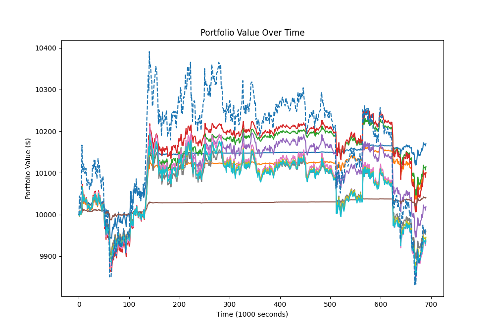
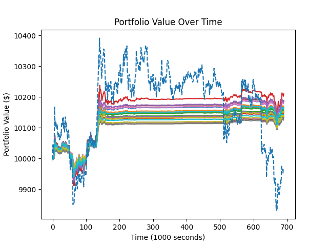
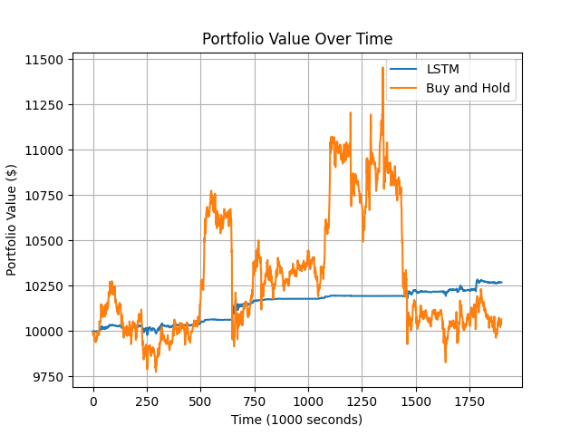
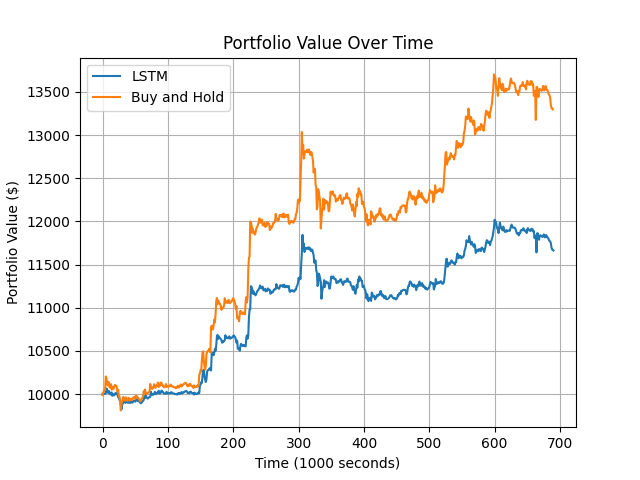
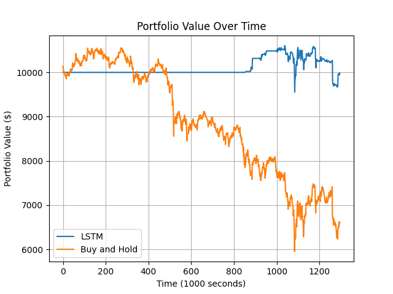
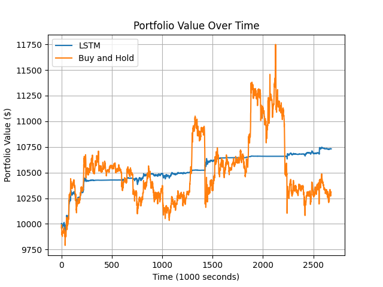

# Bitcoin Algorithmic Trading with LSTM and Pytorch
This is my little project I made because I was interested in algorithmic trading and machine learning.
Essentially It uses a LSTM neural network to predict the price of bitcoin. Then it uses the predicted price plus some indicators to decide whether to buy or sell bitcoin.
This bot is meant to trade one specific currency pair for simplicity's sake.

The goal of this entire project is to learn about data pipelines, data science, machine learning and algorithmic trading. This is purely for educational purposes.

## Requirements
Python 3.11 recommended. Unsure if it works with lower versions of python.
First, pip install the requirements using `pip install -r requirements.txt`. This will install all the required packages.

Then you must manually install `TA_Lib-0.4.24`. This is technical analysis library that I used for a key part of the bot.
You should also manually install the correct version of `pytorch` for your system. You can find the correct version here: https://pytorch.org/get-started/locally/.

## Usage
1. Get second by second data from Binance using `get_new_dataset.bat`. This is a batch file that will run a few python scripts to fetch, clean and feature engineer the data.
This data is stored in a csv file in a folder named `btc_usdt_data`. Rename this folder to `btc_usdt_training_data`. Do this 2 more times and rename the folders to `trading_alg_tuning_data` and `paper_trade_data`.

You may have to adjust the time period in `get_price_data.py` to get the right amount data. I used 3 months of data for training, ~1 week for parameter tuning and about 3 weeks for paper trading. For context, my computer has 32 Gb of RAM and a 3070 ti GPU. Training on 4 months of data barely fits in memory.

2. Train the LSTM neural network using `train_model.py`. At the end, it will create a file named `lstm_model_{MSE}.pt` where `{MSE}` is the mean squared error of the model. This file will be used by the bot to predict prices.

3. Here I used a bit of manual work to tune the parameters of the trading algorithm. `strategy_tuning.py` is used to test different parameters and see which ones are the best based off of sharpe ratio. you may have to adjust the risk-free rate to calculate the correct sharpe ratio. This will output to console, the top 10 parameters based off of sharpe ratio, along with the profit and max drawdown. It also outputs the graph of the top 10 parameters' portfolio value against time. You can then keep searching and then choose your favourite one and use it in the next step in `paper_trading.py`. (Or completely ignore this step and use the parameters I used, the parameters may not be the best for all datasets).

4. Run `paper_trading.py` to see how the algorithm performs on unseen data. This will create a file named `lstm_vs_buy_and_hold.png` which shows the portfolio value of the algorithm vs buy and hold. You can see the results of the test there. In console, the sharpe ratio and max drawdown are printed.

## Details about each file
`get_new_dataset.bat`: Runs the python scripts to get the data from binance, clean it and feature engineer.

`get_price_data.py`: Gets the price data from binance and saves it to a csv file. It specifically fetches the data for 1 second resolution BTC/USDT data. you can change the pair and data resolution. Check the binance api docs for more info.

`clean_data.py`: Cleans the data. rows with missing data and useless columns. It then saves the data to a csv file.

`feature_engineering.py`: Adds features to the data. It adds EMA, BB, RSI, ULTOSC, OBV, AD, ATR, WCLPRICE, HT_DCPERIOD, VAR, and MFI of 3 different time periods (if applicable). It then saves the data to a csv file.

`train_model.py`: Trains the LSTM neural network. It will use hyperparameter search to find the best parameters for the model. It uses the data in `btc_usdt_training_data` to train the model. It will then save the model to a file named `lstm_model_{MSE}.pt` where `{MSE}` is the mean squared error of the model on a subset of `btc_usdt_training_data`. 

`strategy_tuning.py`: Tests different parameters for the trading algorithm. Uses a simulated trade environment to test the parameters, as realistic as I can make it. It will use the data in `trading_alg_tuning_data` to test the algorithm. It will then print the top 10 parameters based off of sharpe ratio, along with the profit and max drawdown. It also outputs the graph of the top 10 parameters' portfolio value against time.

`paper_trading.py`: Tests the algorithm on unseen data in a similar trade environment. It will use the data in `paper_trade_data` to test the algorithm. It will then print the sharpe ratio and max drawdown of the algorithm. It will also output the graph of the portfolio value against time.

## My results
So I used the data from October 1st, 2023 until the end of December 17th, 2023 for training. December 18th to December 26th for parameter tuning. December 27th to January 17th for paper trading. 

My optimal model had a MSE of 1472 which took about a week to train and tune. It ended up being a 4 layer LSTM with 1 final linear output layer. It has 512 hidden units per layer, using a learning rate of 0.01, a batch size of 192.

Tuning the algorithmic trading bot also took about another week to fine tune. I did this twice because the result I ended up with the first time didn't meet my expectations.
Below is a plot of 10 random hyperparameters.

Eventually, I managed to tune the results much more tightly. Shown below is the plot of the top 10 hyperparameters in the final round of tuning.

It had a net profit of +189.02 or 1.89%, a sharpe_ratio of 0.0343 and a max_drawdown of -1.26% over the test period. 
Compared to a simple buy and hold strategy which actually lost a bit of money over the test period with a loss of -0.25%.

This tuning was done in an environment assuming a trading fee of 0.18% per trade. This is the fee that Binance charges for spot trading with a really high volume.
I also derived the risk free rate of 0.0006811% per 1000 seconds from the 3 month US treasury bill yield.

The Paper trading was tested in the in a similar environment with the optimal parameters found earlier. 

The algorithmic trading bot had a net profit of 2.702% and a sharpe ratio of 0.0222 and a max drawdown of 0.613% over the paper trading period.
The buy and hold strategy which had a net profit of 0.68% and a sharpe ratio of 0.000684 and a max drawdown of -14.21% over the paper trading period.

### Further Testing

So lets try testing the algorithmic trading bot in a bull market and a bear market. I will use the same parameters as before.
(Bull market, March 11, 2023 to March 18, 2023)

Meh results for the bull market. It earned half as much as simply buying and holding! still has a lower drawdown and higher sharpe ratio though. Arguably better risk management.
LSTM        : Net profit: 16.81%, Sharpe ratio: 0.0659851, Max drawdown: -0.06478%
Buy and hold: Net profit: 32.96%, Sharpe ratio: 0.0084906, Max drawdown: -0.08566%

(Bear market, May 6, 2021 to May 21, 2021)

Much better results here for a bear market. It is very good at wealth preservation. It has a significantly lower drawdown and higher sharpe ratio than buy and hold!
These downturns are where the bot shines. It is able to avoid large losses and maintain a consistent performance.

LSTM        : Net profit:- 0.18%, Sharpe ratio:-0.0011961, Max drawdown: -0.09947%
Buy and hold: Net profit:-33.88%, Sharpe ratio:-0.0357828, Max drawdown: -0.43565%

## Conclusions

### Net Profit
The algorithmic trading bot out performed the buy and hold strategy in terms of net profit, sharpe ratio and max drawdown.
Comparing net profit, the trading bot made 4 times more profit than the buy and hold strategy! This of course means that the bot is much more profitable than the buy and hold strategy and it can generate more returns over the trading period.

### Sharpe Ratio
The sharpe ratio is a measure of risk-adjusted return. The bot's Sharpe ratio of 0.0222 is significantly higher than the buy and hold strategy's sharpe ratio of 0.000684. What this means is that the bot has a more efficient risk management strategy. It is able to generate more returns per unit of risk than the buy and hold strategy.

### Max Drawdown
The max drawdown is a measure of the largest drop in the portfolio value from a peak to a trough. The bot's max drawdown of 0.613% is significantly lower than the buy and hold strategy's max drawdown of -14.21%. This means that the bot is able to better manage risk and avoid large losses.

### Overall Risk Management
The combination of a higher Sharpe ratio and a much lower max drawdown means that not only is the bot much more profitable than buying and holding, but also managed risk more effectively. Looking at the graph of the portfolio value over time, we can see that the bot is able to avoid large dips in prices (most notably at around the 600s and 1400s mark). However, it seems to miss out on some of the large jumps in value that the buy and hold strategy was able to capture (and then lose). The bot appears to have maintained a more consistent performance with less volatility and smaller losses.

Here are the results one more time.

### Time Period, Market Context and Real World Application
These numbers show the bot's superiority in the tested specific period of time. However, these numbers are based on a fairly simplified trading environment and doesn't take into account slippage and market impact of large orders, as well as different time periods. It is possible that this trading bot doesn't perform well in the real world markets but that is fine for this project. Those could be things I account for and improve on in the future. Maybe I could learn how to model slippage.

The goal of this project was to learn about algorithmic trading and machine learning. I have learned a lot about both of these topics and I am happy with the results of this project!
